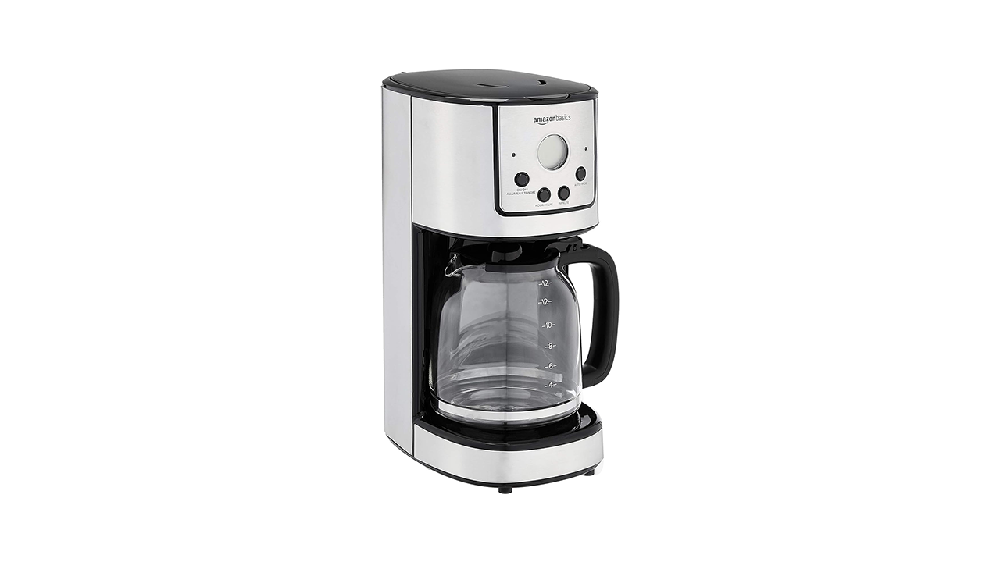
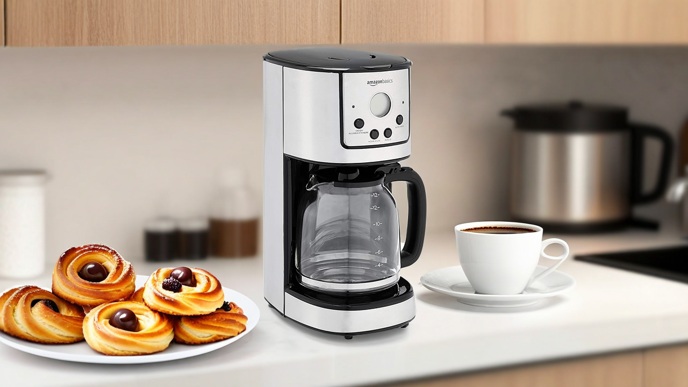

## Background replacement with Amazon Bedrock in R: A Step-by-Step Guide

Developed from [05_background_replacement_using_mask_prompt](https://github.com/aws-samples/amazon-nova-samples/blob/main/multimodal-generation/image-generation/notebook/05_background_replacement_using_mask_prompt.ipynb)

### 1. Load Necessary Libraries

First, we need to load the required libraries for AWS services, JSON handling, base64 encoding/decoding, and image processing.

```r
library(paws)
library(yyjsonr)
library(base64enc)
library(magick)
```

### 2. Define the Image Generation Function

Next, we define a helper function `generate_images` that will handle the image generation process using Amazon Bedrock.

```r
# Function to generate images using Amazon Nova
generate_images <- function(
    inference_params,
    output_directory,
    model_id = "amazon.nova-canvas-v1:0",
    client = NULL) {
  # Create client if not provided
  client <- client %||% bedrockruntime(region = "us-east-1")

  # Invoke the model with the provided parameters
  resp <- client$invoke_model(
    body = write_json_str(inference_params, auto_unbox = TRUE),
    modelId = model_id,
    accept = "application/json",
    contentType = "application/json"
  )

  # Create the output directory if it doesn't exist
  dir.create(output_directory, recursive = TRUE, showWarnings = FALSE)

  # Read the response body and decode the images
  resp_body <- read_json_raw(resp$body)
  img_raw <- lapply(resp_body$images, base64decode)
  img <- lapply(img_raw, image_read)

  # Save the request and response to JSON files
  write_json_file(
    inference_params,
    file.path(output_directory, "request.json"),
    auto_unbox = TRUE, pretty = TRUE
  )
  write_json_file(
    resp_body,
    file.path(output_directory, "response_body.json"),
    auto_unbox = TRUE, pretty = TRUE
  )

  # Save the generated images to the output directory
  for (i in seq_along(img)) {
    image_write(
      img[[i]], file.path(output_directory, sprintf("image_%s.png", i))
    )
  }
}
```

### 3. Set Up Directories and Source Image

We define the directories and specify the source image that we want to use for the image generation task.

```r
# Define directories and source image
DIR <- "amazon_nova_example"
SOURCE_IMAGE <- file.path(DIR, "images/amazon-coffee-maker-1.png")
```

### 4. Encode the Source Image

The source image is encoded to base64 format, which is required for the inference parameters.

```r
# Encode the source image to base64
SOURCE_IMAGE_BASE64 = base64encode(SOURCE_IMAGE)
```

### 5. Define Inference Parameters

We set up the parameters for the image generation task, including the task type, description, mask prompt, and configuration.

```r
# Define inference parameters for the image generation task
INFERENCE_PARAMS <- list(
  taskType= "OUTPAINTING",
  outPaintingParams= list(
    image= SOURCE_IMAGE_BASE64,
    text= "a coffee maker in a sparse stylish kitchen, a single plate of pastries next to the coffee maker, a single cup of coffee. highly detailed, highest quality, product imagery",  # Description of the background to generate
    maskPrompt= "coffee maker",  # The element(s) to keep
    outPaintingMode= "PRECISE"  # "DEFAULT" softens the mask. "PRECISE" keeps it sharp.
  ),
  imageGenerationConfig = list(
    numberOfImages= 1,  # Number of variations to generate. 1 to 5.
    quality= "standard",  # Allowed values are "standard" and "premium"
    cfgScale= 7.0,  # How closely the prompt will be followed
    seed= 123L # Set Seed
  )
)
```

### 6. Generate a Unique ID for the Output Directory

We create a unique ID for the output directory to ensure that each run of the script saves its results in a separate folder.

```r
# Generate a unique ID for the output directory
GENERATION_ID <- strftime(Sys.time(), format = "%Y-%m-%d_%H-%M-%S")
OUTPUT_DIR <- file.path(DIR, "output", GENERATION_ID)
```

### 7. Call the Function to Generate Images

Finally, we call the `generate_images` function with the defined parameters and output directory to generate the images.

```r
# Call the function to generate images
generate_images(INFERENCE_PARAMS, OUTPUT_DIR)
```

<div style="display: flex; justify-content: space-around;">
  <div style="text-align: center;">
    
    <figcaption>Figure 1: Input Image</figcaption>
  </div>
  <div style="text-align: center;">
    
    <figcaption>Figure 2: Output Image</figcaption>
  </div>
</div>
